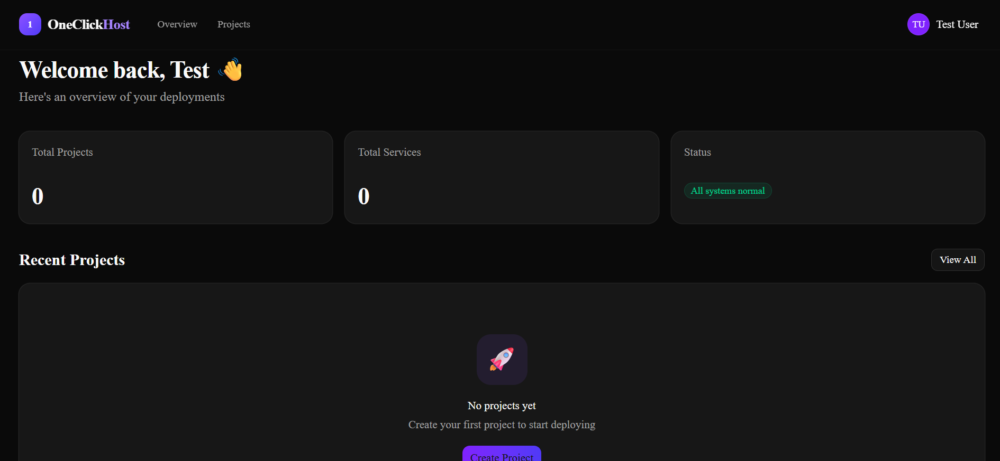

<p align="center">
  
</p>

# OneClick-Host

OneClick-Host is a self-hosted PaaS for deploying GitHub repositories through a dashboard. It clones a submitted repository, detects the stack, builds a Docker image, runs the deployed container, and exposes it through Traefik.



## Architecture

| Component | Technology | Responsibility |
|:---|:---|:---|
| Frontend | Next.js 15 | Dashboard for projects, services, and deployments |
| API | ASP.NET Core | Auth, project state, service config, deployment queue |
| Worker | Python 3.12 | Clone, detect, build, run, and route user workloads |
| Database | PostgreSQL 16 | Persistent state |
| Proxy | Traefik v3.4 | Public HTTP/HTTPS entrypoint and dynamic routing |

Production networking is split by trust boundary:

- `oneclick-control-net`: API, worker, PostgreSQL, frontend, and Traefik.
- `oneclick-apps-net`: Traefik and user-deployed application containers only.

User workloads should not be able to directly resolve or connect to PostgreSQL, API, or worker containers. Traefik is the only public entrypoint in the production Compose file.

## Local Development

1. Copy environment defaults:

   ```bash
   cp .env.example .env
   ```

2. Start with the dev override:

   ```bash
   docker compose -f docker-compose.yml -f docker-compose.dev.yml up -d --build
   ```

3. Local convenience ports:

   - Dashboard: <http://localhost:3000>
   - API: <http://localhost:5000>
   - Traefik dashboard: <http://localhost:8081>
   - Public routed entrypoint: <http://localhost>

The Traefik dashboard is enabled only by `docker-compose.dev.yml`. It is disabled in the production configuration.

## Production Deployment

1. Set strong values in `.env`, especially `POSTGRES_PASSWORD` and `JWT_SECRET`.
2. Configure wildcard DNS, for example `*.example.com`, to your server.
3. Set `TRAEFIK_DOMAIN=example.com`.
4. Start only the production Compose file:

   ```bash
   docker compose up -d --build
   ```

Production Compose publishes only ports `80` and `443` from Traefik. PostgreSQL, API, frontend, worker, and the Traefik dashboard are not directly published.

## Security Checklist for AWS EC2 Deployment

- Expose only ports `80` and `443` publicly.
- Do not expose PostgreSQL, worker, API direct ports, frontend direct ports, or the Traefik dashboard.
- Use restrictive AWS Security Groups; avoid `0.0.0.0/0` except for public HTTP/HTTPS.
- Require strong `POSTGRES_PASSWORD` and `JWT_SECRET` values.
- Require IMDSv2 on EC2 instances.
- Attach only minimal IAM role permissions required for host maintenance.
- Keep the Docker host private and patched.
- Treat the worker as trusted infrastructure. Its Docker socket access is powerful and can control the host Docker daemon.
- Do not run this as an open public PaaS without stronger workload isolation, quotas, abuse monitoring, and ideally a separate build/runtime sandbox such as isolated VMs, Firecracker, gVisor, or a dedicated container build service.

## Guardrails

- Repository URLs must be public `https://github.com/owner/repo` URLs.
- Clones are shallow by default.
- Build jobs enforce `WORKER_BUILD_TIMEOUT`.
- Worker workspaces are cleaned up after deployment success or failure.
- User workload containers are started without Docker socket mounts, host mounts, privileged mode, or host-published ports.
- `MAX_ACTIVE_SERVICES_PER_USER` limits service creation per user.
- `MAX_CONCURRENT_BUILDS` limits the number of deployment jobs a worker process runs at once.
- `DEPLOYMENT_RATE_LIMIT_PER_MINUTE` is reserved for future API rate limiting middleware.

## Supported Stacks

- React
- Next.js
- ASP.NET Core
- Spring Boot with Maven or Gradle

If a repository includes its own `Dockerfile`, OneClick-Host uses it.
